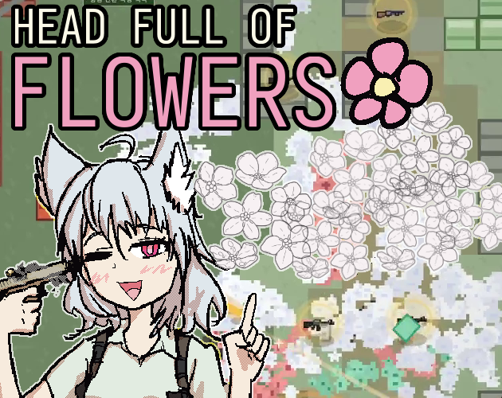

# Head Full Of Flowers



play at https://scarf005.itch.io/head-full-of-flowers

## Running

You need to have Deno v2.0.0 or later installed to run this repo.

Start a dev server:

```
$ deno task dev
```

Install the tracked pre-commit hook:

```
$ deno task hooks:install
```

The hook refreshes SFX credits and translations. Run `$ deno task credits:sync` manually to refresh the credits without committing.

## Deploy

Build production assets:

```
$ deno task build
```

## License

[AGPL-3.0-only](./LICENSE) for source code. For 3rd party assets, see below

## Credit

### Music

- [MY DIVINE PERVERSIONS by hellstar.plus](https://hellstarplus.bandcamp.com/track/my-divine-perversions) - [CC BY 4.0](https://creativecommons.org/licenses/by/4.0/)
- [linear & gestalt by hellstar.plus](https://hellstarplus.bandcamp.com/track/linear-gestalt) - [CC BY 4.0](https://creativecommons.org/licenses/by/4.0/)

### Sound effects

<!-- SFX_CREDITS_START -->

- Flamethrower: [Flamethrower by samsterbirdies](https://freesound.org/s/490166/) - [CC0 1.0](https://creativecommons.org/publicdomain/zero/1.0/)
- Pistol: [Glock 19X by areniporgen](https://freesound.org/s/828786/) - [CC0 1.0](https://creativecommons.org/publicdomain/zero/1.0/)
- Auto shotgun: [SPAS-12 by duesto](https://freesound.org/s/156904/) - [CC0 1.0](https://creativecommons.org/publicdomain/zero/1.0/)
- Shotgun: [Mossberg 500A - 1 shot and pump by AnthonyChan0](https://freesound.org/s/159710/) - [CC0 1.0](https://creativecommons.org/publicdomain/zero/1.0/)
- Grenade launcher: [Grenade Launcher by LeMudCrab](https://freesound.org/s/163458/) - [CC0 1.0](https://creativecommons.org/publicdomain/zero/1.0/)
- Assault rifle: [M16 burst in street.aif by Franki-01234](https://freesound.org/s/201668/) - [CC0 1.0](https://creativecommons.org/publicdomain/zero/1.0/)
- Battle rifle: [FN SCAR-H by areniporgen](https://freesound.org/s/702225/) - [CC0 1.0](https://creativecommons.org/publicdomain/zero/1.0/)
- Explosions: [bad explosion by deleted_user_364925](https://freesound.org/s/47252/) - [CC0 1.0](https://creativecommons.org/publicdomain/zero/1.0/)
- Kill confirm: [heavy punch by damnsatinist](https://freesound.org/s/493913/) - [CC BY 4.0](https://creativecommons.org/licenses/by/4.0/)
- Item acquire: [item-pickup-v2.wav by DeltaCode](https://freesound.org/s/678385/) - [CC0 1.0](https://creativecommons.org/publicdomain/zero/1.0/)
- Character damage: [Item wag by Guinamun](https://freesound.org/s/690623/) - [CC0 1.0](https://creativecommons.org/publicdomain/zero/1.0/)
- Player death: [Sword swing.wav by Angrycrazii](https://freesound.org/s/277322/) - [CC0 1.0](https://creativecommons.org/publicdomain/zero/1.0/)
- Reload: [galil reload sound.mp3 by GFL7](https://freesound.org/s/276963/) - [CC0 1.0](https://creativecommons.org/publicdomain/zero/1.0/)
- Grenade throw: [Grenade Throw by ryanconway](https://freesound.org/s/161622/) - [CC BY 4.0](https://creativecommons.org/licenses/by/4.0/)

<!-- SFX_CREDITS_END -->
